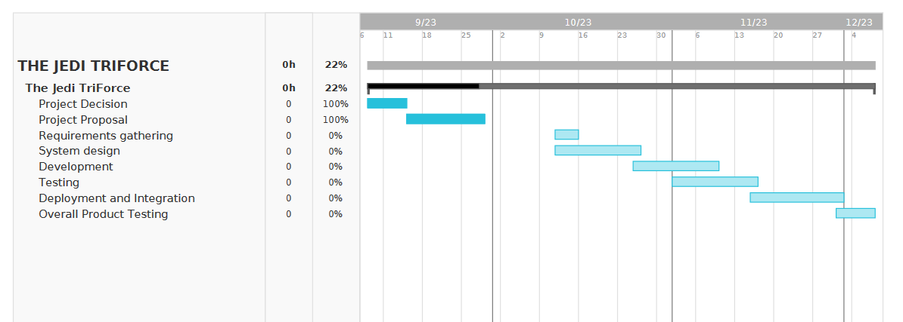

Team name:The Jedi Triforce

Team members: 
Hari Poorna Kumar Kalahasti
Megha Hole
Mary Deepika Basani
Pavani Seshadri

# Introduction

In view of evolving market dynamics and the onslaught of e-commerce, our proposed venture strives to meet a critical business requirement: the construction of an E-Commerce Website that actively engages clients in the digital marketplace. This enterprise aims to capitalize on the tremendous potential of e-commerce and the growing consumer preference for sustainable and ecologically friendly buying options.

Modern customers are becoming more environmentally conscious, actively seeking ways to reduce waste and advocating for a circular economy. Furthermore, there is a growing demand to buy desired products, particularly refurbished items at affordable prices. Recognizing this requirement, our project aims to fill a market return by creating an single point e-commerce platform. 

The E-Commerce Website will not only provide consumers with an environmentally responsible buying experience but it will also be in line with the organization's sustainability goals. We hope to contribute to a more sustainable and environmentally friendly and future by making it easier to buy reconditioned goods, while still addressing market demands and ethical concerns. This platform will mainly focus on the selling of used things, which will include anything from electronics and furniture to appliances and home decors. This project we are developing could be unique because most existing e-commerce platforms focus mainly on the selling of new things.

In conclusion, the goal of this project is to create an e-commerce website which will allows the organization to effectively engage with clients within the online market and profit on the expanding trend of e-commerce. The website will focus on sustainable and eco-friendly purchasing choices, and it will mainly cater to the demands of consumers looking for low-cost refurbished products.

# Anticipated Technologies

Angular
Node JS
MYSQL
Express

# Method/Approach

The high level plan is as follows:
1.	Requirements gathering and analysis: The initial stage will be to collect and analyze the website's requirements. Understanding the demands of the firm, its clients, and the e-commerce market as a whole is part of this.
2.	System design: The system design process will come once the requirements have been compiled and examined. This entails specifying the user interface design, database structure, and system architecture.
3.	Development: The development phase will involve implementing the system design and writing the code for the website while designing will try to create small functionalites.
4.	Testing: While developing will do unit testing however we will need to be thoroughly and carefully tested to ensure that it meets all the requirements and that it is free of any issues.
5.	Integration and Deployment: Once the website has been tested and found to be appropriate, it will be deployed to a production environment after integration of every module.

# Estimated Timeline

The following is an estimated timeline for developing the e-commerce website:
    •	Requirements gathering and analysis: 2 weeks
    •	System design: 2 weeks
    •	Development: 3 weeks
    •	Testing: 1 week
    •	Deployment: 1 week

Total estimated time: 9 weeks

# Anticipated Problems

Some of the potential issues that, we think,could arise while building the e-commerce website are the ones listed below:
• Security: Keeping user data secure is a primary focus for us and yes,for sure security must be taken into consideration during the design and development of the website however this is little concerning considering our scope.
• Scalability: The website must be scalable in order to accommodate large traffic volumes. This is issue for us because of now we are still looking for such a platform.
• Customer service: Providing responsive and efficient customer service is crucial for the website's success.
• Product listings: Managing the website's product listings might be difficult, especially if it sells a wide range of goods.
• Inventory management: It might be difficult to keep track of stock levels and make sure that products are available when clients order them.
