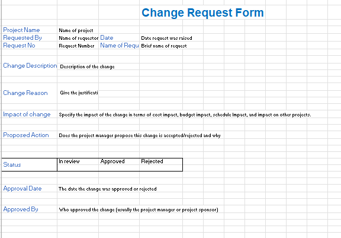

# Overview
This SRS document is for an e-commerce website. It helps guide every involved participant like a roadmap. It outlines the website's need to avoid scope creep and rework. This document works well using the mentioned functional and non-functional requirements to maintain a clear line between what to build and what not to build. On top of that, it's used to communicate everything to other people who will be involved in the project. When everyone is on the same page, everything runs better.
# Software Requirements
Below are the requirements based on functional and non-functional categories.

## Functional Requirements
### User Authentication / Registration
| ID | Requirement |
| :-------------: | :----------: |
| FR1 |Users shall create accounts with a valid email address. |
| FR2 |The system shall verify the uniqueness of email addresses. |
| FR3 |Passwords must meet specified complexity requirements. |
| FR4 | The User shall log in as a customer or seller. |
| FR5 |Users receive a confirmation email upon successful registration. |
| FR6 |Registered users shall log in securely. |

### Product Catalog
| ID | Requirement                                                                             |
| :-------------: |:----------------------------------------------------------------------------------------|
| FR7 | The system shall display products with images, descriptions, and prices.                |
| FR8 | Users shall filter products based on categories (e.g., electronics, clothing).          |
| FR9 | Each product shall have an "Add to Cart" button for easy selection.                     |
| FR10 | Users shall view detailed product information by clicking on a product.                 |
| FR11 | The admin shall be able to add the products to reflect in the catalogue and view the added products. |

### Shopping Cart
| ID | Requirement |
| :-------------: | :----------: |
| FR12 |Users shall view and edit the items in their shopping cart. |
| FR13 |The system calculates and displays the total price in the shopping cart. |
| FR14 |Users shall easily remove items from the cart. |
| FR15 |Cart contents are saved for users with accounts even after logging out. |
| FR16 |Users shall proceed to checkout from the shopping cart. |

### Order Management
| ID |                                  Requirement                                  |
| :-------------: |:-----------------------------------------------------------------------------:|
| FR17 |   Users receive an order confirmation message after completing a purchase.    |
| FR18 | The system generates and displays a unique order number for each transaction. |
| FR19 |  Users shall view their order history and track the status of their orders.   |
| FR20 |            Users shall initiate returns or exchanges for products.            |
| FR21 |                      User shall be able to filter orders                      |

### Payment Integration
| ID | Requirement |
| :-------------: | :----------: |
| FR22 | The User shall see the total amount, including all products and counts. |
| FR23 |The payment gateway shall only contain the product and total cost. |
| FR24 |The system supports one-click payments for registered users. |
| FR25 |Users receive a payment confirmation after a successful transaction. |
| FR26 |Failed transactions trigger appropriate error messages. |

## Non-Functional Requirements
### Performance
| ID | Requirement |
| :-------------: | :----------: |
| NFR1 |The website shall load quickly for all users. |
| NFR2 |The system shall handle concurrent user loads. |
| NFR3 |Database queries shall be optimized to retrieve product information and order processing quickly. |
| NFR4 |Images shall be compressed with high quality to reduce page load times. |
| NFR5 |The website shall be responsive and accessible on various browsers. |

### Security
| ID | Requirement |
| :-------------: | :----------: |
| NFR6 |User passwords shall be securely stored. |
| NFR7 |Users shall be authorized to access features and data based on their assigned roles and permissions. |
| NFR8 | User shall be authenticated based upon token to mitigate the risk of unauthorized access using stale tokens. |
| NFR9 |Product image uploads shall be conducted over a secure transport layer to encrypt data in transit. |
| NFR10 |Regular security audits and vulnerability assessments shall be conducted. |

### Scalability
| ID | Requirement |
| :-------------: | :----------: |
| NFR11 |The system architecture shall be scalable to accommodate future growth. |
| NFR12 |The website shall handle a 20% increase in traffic during peak times. |
| NFR13 |Load balancing shall be implemented to distribute traffic evenly. |
| NFR14 |The database shall be scalable to store a growing number of products and users. |
| NFR15 |The system shall support easy integration with additional third-party services. |

### Reliability
| ID | Requirement |
| :-------------: | :----------: |
| NFR16 |The website shall have 99.9% uptime. |
| NFR17 |Automated backups of the database shall be performed daily. |
| NFR18 |In Case of server failure, the system shall have a failover mechanism. |
| NFR19 |Users shall experience minimal disruptions during routine maintenance. |
| NFR20 |User Session shall be maintained even after the browser closes. |

### Usability
| ID | Requirement |
| :-------------: | :----------: |
| NFR21 |The website shall be designed with a user-friendly interface. |
| NFR22 |Navigation, such as product, checkout, and order history pages, shall be intuitive. |
| NFR23 |Product pages shall have high-quality images and informative descriptions. |
| NFR24 |The checkout process shall be streamlined with minimal steps. |
| NFR25 |The website shall be compatible with major web browsers. |
| NFR26 |Users can find the products based on the listed categories. |
| NFR27 |Customers shall see the newly added products on the home page. |

# Change management plan
A thorough Change Management Plan for integrating E-Commerce applications into a customer's business environment is described in this document. It covers essential areas such as training, integration with current systems, and problem-solving to guarantee a seamless and effective implementation.
The attached Excel sheet follows the process of making a change request.

##### Target Audience:

All employees involved in the e-commerce operations, including:
- Customer service representatives
- Inventory managers
- Marketing and sales teams
- Warehouse personnel
- Order fulfillment specialists
- IT personnel responsible for system integration.
- Managers and stakeholders involved in the implementation process.

### Change Management Strategy:

##### Planning and Communication:

-   Start with the town hall to inform all employees about the new system.
-   Managers must involve the employees and follow the process.
-   Clearly define the new system and its purpose with a communication plan that outlines key messages, timelines, and communication channels for informing stakeholders.
-   Develop accurate, to-the-point training materials specific to user roles and responsibilities.
-   Keep track of the process while handing over and shadowing on SharePoint based on critical points for the new system - performance, user requirement satisfaction, and maintenance.

##### Training and Shadow Knowledge Transfer:
-   Define and configure the application according to the integration plan.
-   Conduct interactive training sessions for users based on their roles and responsibilities.
-   Motivate the employees to demonstrate how this system is better.
- Support users via various channels, including FAQs, technical support, and documentation.
-   Make a smooth handover of the system and offer Shadow Knowledge Transfer.
-   Utilize the Shadow Knowledge Transfer phase to monitor the system and assist the client with hands-on system activity.

##### Evaluation Metrics:
-   Establish a central method to monitor the system based on budget, cost reductions, time efficiency, etc.
-   Involve higher management to show progress and advantages of the new system, prioritize issues based on severity and impact on business operations and keep the process transparent.
-   Define a straightforward escalation process for complex issues requiring technical expertise.
-   Capture a high user adoption rate driven by reduced process times, increased productivity, decreased support tickets, and positive user feedback, demonstrably validating the success of the implemented change.

# Traceability links

## Use Case Diagram Traceability

| Artifact ID |           Artifact Name           | Requirement ID |
| :-------------: |:---------------------------------:| :----------: |
|[UseCase for Customer](https://github.com/haripoorna/GVSU-CIS641-the-jedi-triforce/blob/main/artifacts/structural-and-behavioral-modelling/use_case_diagram.pdf) |User Authentication / Registration | FR1-FR6, FR-16, NFR-7, NFR-20 |
|[UseCase for Customer](https://github.com/haripoorna/GVSU-CIS641-the-jedi-triforce/blob/main/artifacts/structural-and-behavioral-modelling/use_case_diagram.pdf) |          Cart Management          | FR-12-16, NFR16, NFR19, NFR21, NFR23, NFR24  |
| [UseCase for Admin](https://github.com/haripoorna/GVSU-CIS641-the-jedi-triforce/blob/main/artifacts/structural-and-behavioral-modelling/use_case_diagram.pdf)  |         Managing Products         | FR-11, NFR9 NFR12, NFR14, NFR14 NFR17, NFR23 |

## Class Diagram Traceability
| Artifact Name |  Requirement ID |
| :-------------: |:----------: |
| [Class Order](https://github.com/haripoorna/GVSU-CIS641-the-jedi-triforce/blob/main/artifacts/hci/class_diagram.pdf)| FR17,FR18,FR19,FR20,FR21,NFR22  |
| [Class User](https://github.com/haripoorna/GVSU-CIS641-the-jedi-triforce/blob/main/artifacts/hci/class_diagram.pdf) | FR1,FR2,FR3,FR4,FR5,FR6,NFR6,NFR7,NFR8,,FR19 |
| [Class Shopping Cart](https://github.com/haripoorna/GVSU-CIS641-the-jedi-triforce/blob/main/artifacts/hci/class_diagram.pdf) | FR12,FR13,FR14,FR15,FR16,NFR27,NFR24 |
| [Class Product](https://github.com/haripoorna/GVSU-CIS641-the-jedi-triforce/blob/main/artifacts/hci/class_diagram.pdf) | FR7,FR8,FR9,FR10,FR11,NFR9,NFR23 |

## Activity Diagram Traceability
| Artifact ID | Artifact Name | Requirement ID | 
| :-------------: |:----------: | :-------------: |
|[Activity Diagram 1](https://github.com/haripoorna/GVSU-CIS641-the-jedi-triforce/blob/main/artifacts/structural-and-behavioral-modelling/activity_diagram.pdf) | Activity Diagram for User Authentication | FR1, FR5, FR6, FR7, NFR7, NFR8  |
|[ActivityDiagram 2](https://github.com/haripoorna/GVSU-CIS641-the-jedi-triforce/blob/main/artifacts/structural-and-behavioral-modelling/activity_diagram.pdf) | Activity Diagram for Order Management | FR17, FR18, FR20,  NFR18, NFR22 |

# Software Artifacts

The artefact collection includes essential Class, Use Case, and Activity diagrams, offering insights into system structure and behaviour. Diagrams such as Data Persistence and Objects provide details on data storage and runtime objects. CRC Cards outline class responsibilities, providing a comprehensive visual understanding of the system's architecture and functionality. Access the artefacts through the provided hyperlinks for further details.

* [Class Diagram](https://github.com/haripoorna/GVSU-CIS641-the-jedi-triforce/blob/main/artifacts/hci/class_diagram.pdf)
* [Use Case Diagram](https://github.com/haripoorna/GVSU-CIS641-the-jedi-triforce/blob/main/artifacts/structural-and-behavioral-modelling/use_case_diagram.pdf)
* [Activity Diagram](https://github.com/haripoorna/GVSU-CIS641-the-jedi-triforce/blob/main/artifacts/structural-and-behavioral-modelling/activity_diagram.pdf)
* [Data Persistence Diagram](https://github.com/haripoorna/GVSU-CIS641-the-jedi-triforce/blob/main/artifacts/hci/data_persistence.pdf)
* [CRC Card](https://github.com/haripoorna/GVSU-CIS641-the-jedi-triforce/blob/main/artifacts/structural-and-behavioral-modelling/CRC_CLASS_OBJECT.pdf)
* [Window Navigation Diagram](https://github.com/haripoorna/GVSU-CIS641-the-jedi-triforce/blob/main/artifacts/hci/window_navigation_diagram.pdf)
* [Object Diagram](https://github.com/haripoorna/GVSU-CIS641-the-jedi-triforce/blob/main/artifacts/hci/object_diagram.pdf)
